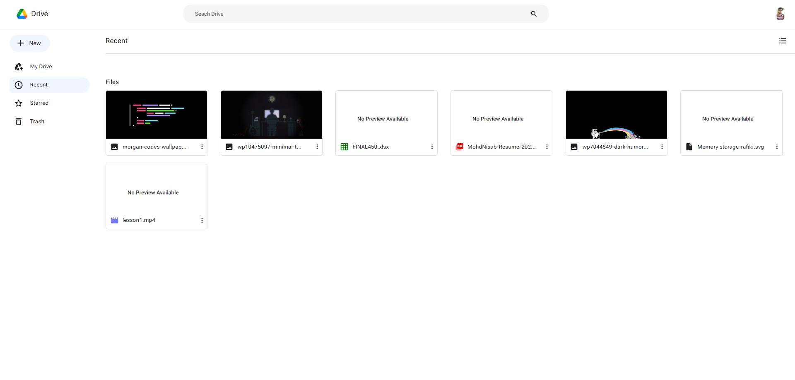
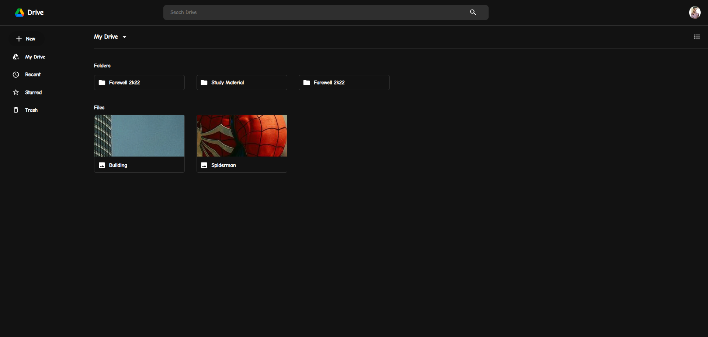

<h1 align="center">Google Drive Clone</h1>

### Features
- Login using Google
- Upload Files and Create New Folder
- Dark Mode
- Material 13 
- Nested Complex Folder Structure

### Tech Used
- ReactJS with MUI
- NodeJS and Express
- MongoDB for complex nested folder structure
- Firebase Storage 

### Project Structure
    
    ├── client          # React App
    │   ├── public         
    │   └── src           # React Components
    |          
    ├── images               # Screenshots
    ├── server                  # Node Server
    ├── LICENSE
    └── README.md

### overview 

